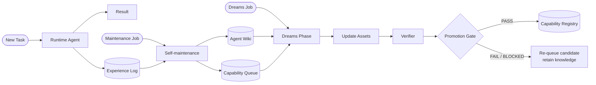

# OpenCapability

**From experience to verified agent capabilities.**

OpenCapability is a lightweight framework for agents that need to improve over time without turning every lesson into a new skill.

The idea is simple: an agent should improve **capabilities**, not just accumulate instructions.

A capability is something the system can reliably do from the outside: retrieve the right project context, perform grounded research, follow a stable coding workflow, remember durable preferences, recover from known failure modes, and so on.

A skill may help implement a capability, but it is only one possible asset. The actual fix might be a better memory entry, a wiki page, a routing rule, a tool check, a prompt template, a test, or a change in runtime policy.

So the basic question is not:

> What skill should the agent create?

It is:

> **What capability should improve, what needs to change to improve it, and how do we know the change actually worked?**

OpenCapability is influenced by [WikiSkill](https://arxiv.org/abs/2608.27454), which separates raw experience from persistent knowledge and executable skills, and by [OpenSkill](https://arxiv.org/abs/2606.06741), which acquires grounded knowledge and verification anchors from open-world resources.

- **WikiSkill** is mostly about learning from the agent's own experience.
- **OpenSkill** is mostly about learning from the external world.
- **OpenCapability** is about deciding what should improve, changing the right asset, and verifying the result.

A compact way to think about it is:

1. **Runtime Agent → Experience Log:** collect traces, feedback, errors and successes from real runs.
2. **Self-maintenance → Agent Wiki:** turn recurring patterns into persistent knowledge.
3. **Self-maintenance → Capability Queue:** identify what the agent still cannot do reliably and queue it for deeper analysis.
4. **Dreams Phase → Assets:** decide what should change and update the right asset: skill, memory, retrieval, tooling, policy, or documentation.
5. **Verifier → Promotion Gate:** test whether the change actually improves the capability.
6. **Capability Registry → Runtime Agent:** promote verified capabilities and make them available for future tasks.

## How the loop works

Normal task execution, lightweight maintenance, and deeper capability evolution run on different cadences.



The three entry points are intentionally separate:

- a **new task** starts normal execution by the runtime agent;
- a **maintenance job** reviews recent experience and keeps the knowledge base healthy;
- a **Dreams job** performs the slower, more expensive work of evolving capabilities.

The runtime agent uses capabilities already marked as active in the Capability Registry. Failed or blocked attempts are not wasted work: the candidate can go back to the queue, while useful evidence remains in the Agent Wiki.

## Minimal implementation

OpenCapability does not require a large platform. A first implementation can be little more than a few versioned files:

```text
open-capability/
├── capabilities/
│   ├── index.yaml
│   └── <capability>.yaml
├── queue.yaml
├── agent-wiki/
├── skills/
├── failure-log/
└── eval-log/
```

The exact storage is not important. These can be Markdown files, YAML, a database, issue trackers, or existing agent memory systems. What matters is keeping the responsibilities separate.

## A few design rules

1. **Capability first, asset second.** Decide what should improve before deciding how to implement it.
2. **Experience is not knowledge.** Consolidate before generalizing.
3. **Knowledge is not instruction.** A wiki observation can stay descriptive until there is enough evidence to operationalize it.
4. **Skills are optional.** Memory, retrieval, tooling, documentation, or policy may be the real fix.
5. **Verification is independent.** Builder confidence is not evidence.
6. **Promotion is explicit.** The runtime agent should rely only on capabilities that have earned runtime eligibility.
7. **Failed attempts still teach.** Keep useful evidence even when an implementation is rejected.
8. **Prefer small, reversible changes.** Self-improvement should be inspectable and easy to roll back.
9. **Preserve provenance.** A capability should be traceable back to evidence, assets, and evals.
10. **Separate maintenance from evolution.** Frequent jobs consolidate; slower jobs redesign and promote.

## The pieces

### Experience

Experience is the raw record of what happened while the agent was working: trajectories, conversations, tool calls, errors, recoveries, successful outcomes, user feedback, and evaluation results.

It is evidence, not yet knowledge.

Keeping this distinction matters. A single bad run should not immediately become a permanent rule.

### Agent Wiki

The Agent Wiki is persistent experiential knowledge: what the system has learned across runs.

It can contain recurring patterns, failure modes, root causes, successful strategies, counterexamples, preferences, provenance, and previous improvement attempts.

A useful rule is:

> **The wiki stores what the agent has learned. Skills store behavior the agent has decided to operationalize.**

That separation lets knowledge accumulate before it is turned into procedure. It also means a failed skill patch does not erase the underlying lesson.

### Capability Queue

The queue is the intake for things that may deserve improvement.

Typical entries are observations such as:

- the agent repeatedly misses the right project context;
- the same formatting correction appears across several sessions;
- a tool is available but often used incorrectly;
- a coding workflow works only when a particular sequence is followed;
- retrieval succeeds for one phrasing but fails for equivalent queries.

Not every queue item needs to become a formal capability. The Dreams phase can merge, defer, reject, or reclassify them.

### Assets

Assets are the things that actually implement behavior.

Examples include:

- skills;
- memory;
- retrieval indexes and routing rules;
- prompt templates;
- scripts and tools;
- documentation;
- runtime policies;
- examples and checklists;
- test suites.

The important part is diagnosing the gap before choosing the asset.

If the problem is retrieval, adding another skill may make the system worse. If the problem is missing knowledge, the right answer may simply be to improve the wiki. If the problem is runtime capability, documentation alone will not fix it.

### Verification

An improvement is not promoted because the builder thinks it looks better.

It needs evidence.

A verification anchor can be an automated test, a build command, a retrieval probe, an invariant, a checklist, an authoritative source, an expected input/output example, or a structured manual review.

The builder changes the system. The verifier checks the change.

That separation does not require a different model, but it does require a different role and independent evidence.

## Capability Registry

The Capability Registry is the small control plane that ties the system together.

It is **not** another knowledge base and it is **not** a skill store. It is a versioned catalog of capabilities the system has qualified, together with the assets that support them and the evidence that justifies their current state.

It should answer questions such as:

- What can the system currently do reliably?
- Which capabilities are candidates, active, degraded, blocked, or deprecated?
- Which assets implement a capability?
- Which wiki knowledge led to the current implementation?
- What verification allowed it to become active?
- What failure modes are already known?

A capability entry can stay small:

```yaml
id: cap.reliable_tdd_development
name: Reliable TDD Development
status: active

goal: >
  Modify code through reproducible RED → GREEN → REFACTOR cycles.

assets:
  skills:
    - skill://tdd-development
  tools:
    - tool://pytest
  routing:
    - router://project-context

knowledge_basis:
  - wiki://coding/premature-implementation
  - wiki://coding/unverified-fixes

verification:
  last_result: PASS
  anchors:
    - test fails before implementation
    - targeted test passes after implementation
    - regression suite passes

known_failure_modes:
  - implementation_before_red
  - overfit_single_test
  - skipped_regression_check

runtime_eligible: true
version: 4
```

The registry stores references and state. It should not duplicate the contents of the wiki or the procedures inside a skill.

A minimal lifecycle is enough for most implementations:

```text
observed → queued → candidate → active → degraded / deprecated
                    ↘ blocked
```

Verification method is metadata, not a lifecycle state. Likewise, `skill-backed` describes how a capability is implemented, not where it sits in the lifecycle.

## Self-maintenance vs Dreams

These two loops have different jobs.

### Self-maintenance

Self-maintenance is the frequent, lightweight pass over recent activity.

Its job is mostly to:

```text
detect → classify → consolidate → micro-fix → queue
```

It reads recent trajectories and failures, updates the wiki, performs small low-risk fixes, and adds stronger signals to the Capability Queue.

It should normally not redesign major parts of the system or promote large new capabilities.

### Dreams phase

Dreams is the slower evolution loop.

Its job is closer to:

```text
pattern mining → capability selection → asset update → verification → promotion
```

It looks across sessions, groups related signals, chooses a small number of high-leverage candidates, decides which assets need to change, runs a builder, and sends the result through an independent verifier and promotion gate.

If a candidate fails, the implementation can be rejected while the knowledge that motivated it remains useful.

## Diagnose before you patch

A small failure taxonomy helps avoid the default reaction of "make another skill".

| Gap | Typical response |
|---|---|
| `knowledge_gap` | Wiki, memory, documentation |
| `retrieval_gap` | Index, routing, tags, query probes |
| `procedure_gap` | Skill, checklist, prompt procedure |
| `format_gap` | Template, output contract, focused skill patch |
| `runtime_gap` | Tool checks, fallback behavior, blocked state |
| `verification_gap` | Better anchors, tests, reviewer protocol |
| `overfitting_gap` | Narrower scope, revert, broader evals |
| `duplication_gap` | Reuse, merge or deprecate existing assets |
| `staleness_gap` | Refresh or deprecate knowledge |

## Relationship to WikiSkill and OpenSkill

OpenCapability is not an implementation of either paper.

It borrows a useful separation from **WikiSkill**: raw experience should first become persistent knowledge, and that knowledge should survive individual skill changes.

It borrows a complementary idea from **OpenSkill**: when the agent does not already know enough, external resources can provide grounded knowledge and independent verification anchors.

OpenCapability puts those ideas inside a broader lifecycle where the thing being improved is a capability, and the resulting change may target a skill, memory, retrieval, tooling, documentation, or policy.

## Status

**Early specification / v0.1.**

The goal for now is to keep the framework small enough to reason about and concrete enough to implement in real agents.

Likely next steps:

- formalize the Capability Registry schema;
- build a minimal reference implementation;
- define maintenance and Dreams job templates;
- add concrete verifier and promotion-gate examples;
- test the loop with a persistent Agent Wiki and a real skill system.

## References

- Tang et al., **WikiSkill: Compiling Agent Experience into Persistent Knowledge for Skill Evolution**, 2026. https://arxiv.org/abs/2608.27454
- Yan et al., **OpenSkill: Open-World Self-Evolution for LLM Agents**, 2026. https://arxiv.org/abs/2606.06741

## License

Apache License 2.0. See [LICENSE](LICENSE).
