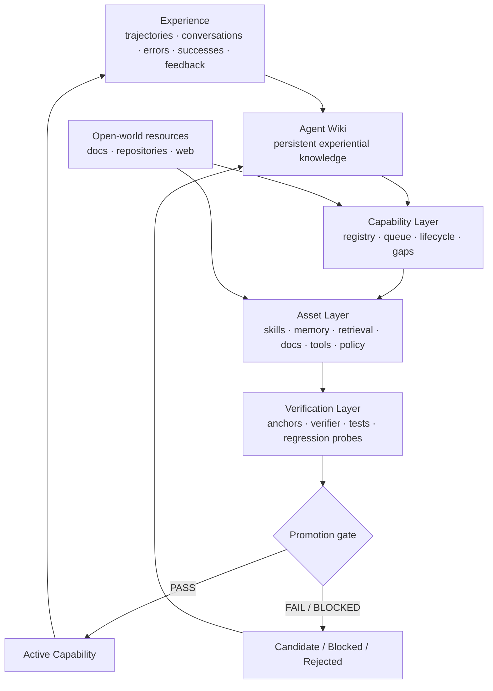

# OpenCapability

**From experience to verified agent capabilities.**

OpenCapability is a lightweight framework for evolving AI agents over time in a controlled, inspectable and verifiable way.

The core idea is simple:

> An agent should not improve only by creating more skills. It should improve **observable capabilities**, using the right assets and proving that the improvement is real.

OpenCapability treats skills as one implementation asset among many. A capability may be backed by skills, memory, a wiki, retrieval/routing, documentation, tools, runtime policies, tests, or a combination of them.

The framework is inspired by the separation introduced by [WikiSkill](https://arxiv.org/abs/2608.27454) between raw experience, persistent knowledge and executable skills, and by [OpenSkill](https://arxiv.org/abs/2606.06741), which acquires grounded knowledge and verification anchors from open-world resources.

OpenCapability generalizes these ideas around a higher-level question:

> **What capability should improve, which assets should change, and what evidence is sufficient to promote the improvement?**

## Core model

```text
Experience → Knowledge → Capability gap → Asset change → Verification → Active capability
```

A useful mental model is:

- **WikiSkill:** learn from the agent's own experience.
- **OpenSkill:** learn from the external world.
- **OpenCapability:** decide what capability to improve, through which assets, and verify the result.

## Logical architecture



## The five layers

### 1. Experience

Raw evidence produced while the agent works:

- trajectories;
- conversations;
- tool results;
- errors and recoveries;
- successes;
- user feedback;
- evaluation results.

Raw experience should remain inspectable and should not be confused with durable knowledge.

### 2. Knowledge: the Agent Wiki

The wiki is the persistent knowledge layer between raw experience and executable behavior.

It can contain:

- observations;
- recurring patterns;
- failure modes;
- root causes;
- successful strategies;
- counterexamples;
- preferences and conventions;
- evidence and provenance;
- previous failed improvement attempts.

The wiki answers:

> **What has the agent learned?**

It should not automatically turn every observation into an instruction.

### 3. Capability

A **capability** is an observable ability of the system.

Examples:

- retrieve the right project context;
- perform grounded research;
- develop code through reliable TDD loops;
- maintain coherent long-term memory;
- produce a stable user-requested output format;
- detect when required tooling is unavailable;
- recover from recurring operational failures.

A capability is not the same thing as a skill.

A single capability may depend on multiple assets, and many capabilities may require no dedicated skill at all.

### 4. Assets

An asset is anything that helps implement a capability.

Typical assets include:

- skills;
- memory;
- wiki pages;
- retrieval indexes;
- routing rules;
- documentation;
- prompt templates;
- scripts;
- tools;
- runtime policies;
- examples;
- checklists;
- test suites.

The important rule is:

> **Do not create a skill when the real problem is knowledge, retrieval, tooling or verification.**

### 5. Verification

An improvement is not promoted because the builder believes it is better.

It needs independent evidence.

A **verification anchor** can be:

- an automated test;
- a build command;
- a retrieval probe;
- an invariant;
- a checklist;
- an authoritative source;
- an expected input/output pair;
- a regression probe;
- a structured manual review.

The builder modifies. The verifier checks.

## Capability Registry

The Capability Registry is **not** another knowledge base and it is **not** a skill store.

It is the system's **capability control plane**: a versioned catalog of observable capabilities, their lifecycle state, supporting assets, knowledge provenance, verification evidence, known failure modes and runtime eligibility.

The registry answers questions such as:

- What can the system currently do reliably?
- Which capabilities are still candidate or degraded?
- Which assets implement a capability?
- Which evidence justified its promotion?
- Which failure modes are known?
- Which capability should be revisited by maintenance or deeper evolution?

Example:

```yaml
id: cap.reliable_tdd_development
name: Reliable TDD Development
status: active

goal: >
  Modify code through reproducible RED → GREEN → REFACTOR cycles.

assets:
  skills:
    - skill://tdd-development
  tools:
    - tool://pytest
  routing:
    - router://project-context

knowledge_basis:
  - wiki://coding/premature-implementation
  - wiki://coding/unverified-fixes

verification:
  anchors:
    - test fails before implementation
    - targeted test passes after implementation
    - regression suite passes
  last_result:
    verdict: PASS
    eval_id: eval-017

known_failure_modes:
  - implementation_before_red
  - overfit_single_test
  - skipped_regression_check

runtime_eligible: true
version: 4
```

The registry stores **references**, not duplicated knowledge or procedures.

## Capability lifecycle

A capability can move through explicit states:

```text
observed
→ queued
→ documented
→ candidate
→ retrieval_verified / sandbox_verified
→ skill_backed (optional)
→ active
→ active_watchpoint
→ degraded
→ blocked
→ deprecated
```

Not every capability must become skill-backed. A capability can become active through memory, routing, documentation, tooling or policy changes alone.

## Runtime, Self-maintenance and Dreams

OpenCapability separates normal task execution from lightweight maintenance and deeper evolution.

```mermaid
flowchart LR
    U[User / Task] --> H[Runtime agent]
    H --> ACT[Use active capabilities]
    ACT --> OUT[Response / Action]
    OUT --> EXP[New experience]

    EXP --> SM[Self-maintenance]
    SM --> DET[Detect patterns]
    DET --> CLS[Classify gap]
    CLS --> MF[Safe micro-fixes]
    MF --> W[Update Agent Wiki]
    W --> Q[Update OpenCapability Queue]

    Q --> D[Dreams phase]
    D --> PC[Cluster patterns into capabilities]
    PC --> SEL[Select high-leverage candidates]
    SEL --> AS[Choose assets to modify]
    AS --> B[Builder]
    B --> VER[Independent verifier]
    VER --> G{Promotion gate}
    G -->|PASS| REG[Capability Registry]
    REG --> ACT
    G -->|FAIL / BLOCKED| KEEP[Keep knowledge + candidate state]
    KEEP --> W
```



### Runtime

Runtime should prioritize task completion and use already active capabilities.

It should not perform heavy redesign. It mainly produces new evidence.

### Self-maintenance

Self-maintenance is the lightweight loop:

```text
detect → classify → micro-fix → consolidate → queue
```

Typical responsibilities:

- read recent trajectories and failures;
- detect recurring patterns;
- classify the gap;
- perform small, low-risk fixes;
- update the Agent Wiki;
- add stronger signals to the OpenCapability Queue.

It should normally **not** promote major new capabilities.

### Dreams phase

The Dreams phase is the deeper evolution loop:

```text
pattern mining → capability design → asset update → verifier → promotion gate
```

Typical responsibilities:

- analyze cross-session evidence;
- group recurring patterns into capability gaps;
- select a small number of high-leverage candidates;
- decide which assets should change;
- build or patch assets;
- run independent verification;
- promote, defer, block or reject.

A rejected skill patch does not imply that the underlying knowledge is wrong. The wiki can retain the knowledge and the failed attempt as evidence for future iterations.

## Failure classification

Before changing an asset, classify the failure.

| Gap | Typical response |
|---|---|
| `knowledge_gap` | Wiki, memory, documentation |
| `retrieval_gap` | Index, routing, tags, hub pages, query probes |
| `procedure_gap` | Skill, checklist, prompt procedure |
| `format_gap` | Template, skill patch, output contract |
| `runtime_gap` | Tool checks, fallback, blocked state, guardrail |
| `verification_gap` | Better anchors, tests, reviewer protocol |
| `overfitting_gap` | Narrow scope, revert, broader evals |
| `duplication_gap` | Merge, reuse or deprecate assets |
| `staleness_gap` | Refresh or deprecate knowledge |

## Minimal data model

A practical implementation can start with only a few persistent objects:

```text
open-capability/
├── capabilities/
│   ├── index.yaml
│   └── <capability>.yaml
├── queue.yaml
├── agent-wiki/
├── skills/
├── failure-log/
└── eval-log/
```

This is intentionally small. OpenCapability is a framework for organizing evolution, not a requirement to introduce a large orchestration platform.

## Design principles

1. **Capability first, asset second.** Diagnose what should improve before deciding to create a skill.
2. **Experience is not knowledge.** Consolidate before operationalizing.
3. **Knowledge is not instruction.** A wiki observation may remain descriptive for a long time.
4. **Skills are optional assets.** Not every improvement should become a skill.
5. **Verification is independent.** Builder confidence is not evidence.
6. **Promotion is explicit.** Runtime should use only capabilities that are eligible for runtime use.
7. **Failed implementations still teach.** Keep useful knowledge even when a patch is rejected.
8. **Prefer small, reversible changes.** Avoid theatrical self-improvement.
9. **Preserve provenance.** A capability should be traceable back to assets, evidence and evals.
10. **Separate lightweight maintenance from deep evolution.** Frequent jobs consolidate; slower jobs redesign and promote.

## Relationship to WikiSkill and OpenSkill

OpenCapability is an independent conceptual framework. It is not an implementation of WikiSkill or OpenSkill.

It borrows two useful ideas:

- **WikiSkill** shows the value of a persistent knowledge layer that separates raw experience from executable skills and lets knowledge survive individual skill updates.
- **OpenSkill** shows how open-world resources can provide both grounded knowledge and verification anchors when the system does not already possess them.

OpenCapability places these mechanisms inside a more general capability lifecycle where the resulting change may target a skill, memory, retrieval, documentation, policy, tooling or another asset.

## Status

**Early specification / v0.1.**

The current goal is to keep the framework small enough to reason about and concrete enough to implement in real agents.

Next useful steps include:

- a formal Capability Registry schema;
- a minimal reference implementation;
- runtime capability routing;
- maintenance and Dreams job templates;
- eval and promotion-gate examples;
- integration experiments with persistent agent wikis and skill systems.

## References

- Tang et al., **WikiSkill: Compiling Agent Experience into Persistent Knowledge for Skill Evolution**, 2026. https://arxiv.org/abs/2608.27454
- Yan et al., **OpenSkill: Open-World Self-Evolution for LLM Agents**, 2026. https://arxiv.org/abs/2606.06741

## License

Apache License 2.0. See [LICENSE](LICENSE).
